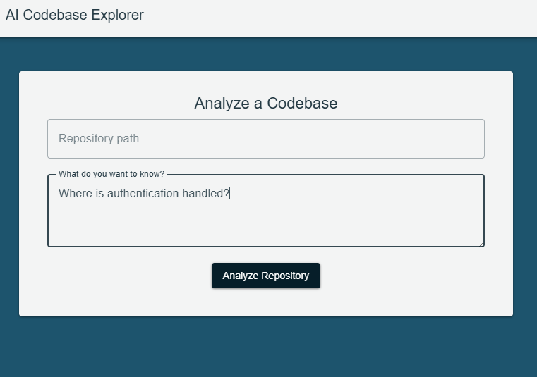

# Repo Explorer

AI agent to explore a code repository for developer.

Purpose:

1. To learn LangGraph
2. How to built an AI Agent Service (in this case, implemented in Python using
   LangGraph) to communicate with another service (ruby on rails API)
3. To have a useful tool for aid in learning and trouble-shooting in an
   unfamiliar code repository.
4. To learn the ruby on rails and python's FastAPI frameworks

Current Status: 2026-09-01
Prototype of a simple UI



## Dev Setup

### Python AI Agent Service

Start FastAPI project

```bash
   uvicorn app.main:app --reload
```

### Swagger API Doc for Agent Service

Run service then Go to: http://localhost:8000/docs

### Vue Frontend

Go to Frontend folder, install dependencies.

```bash
  npm install
  npm run dev
```

### Ruby on Rails Backend

Note: this is for a further development once the tool been implement,
to have it become a saas product where users can save a number of code
repo
